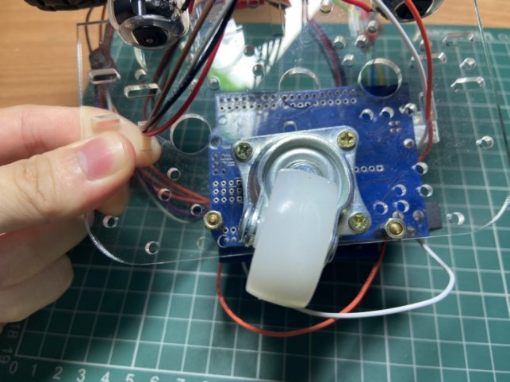
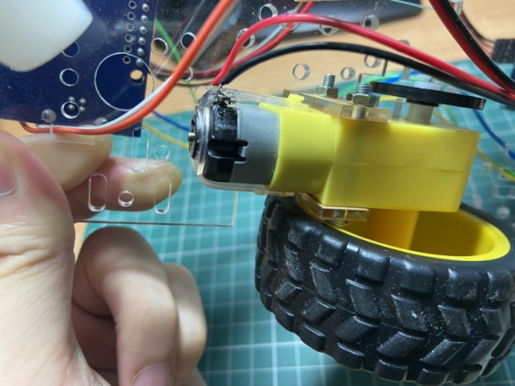
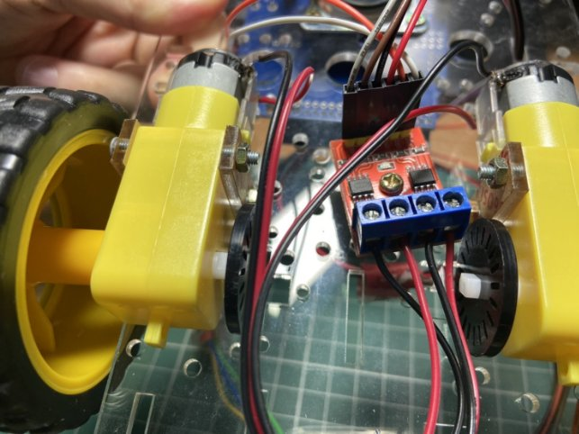
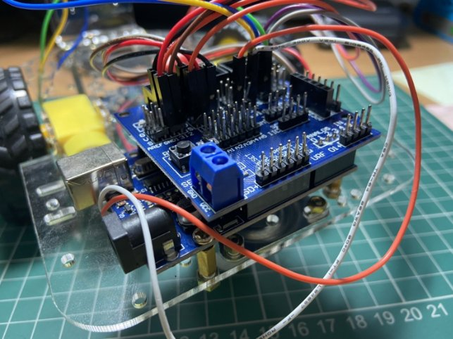
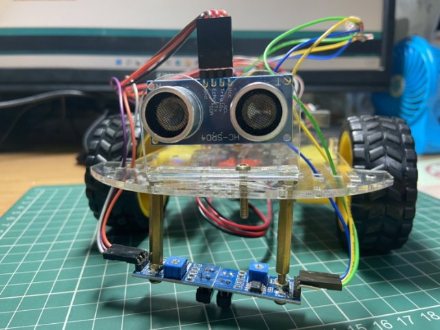
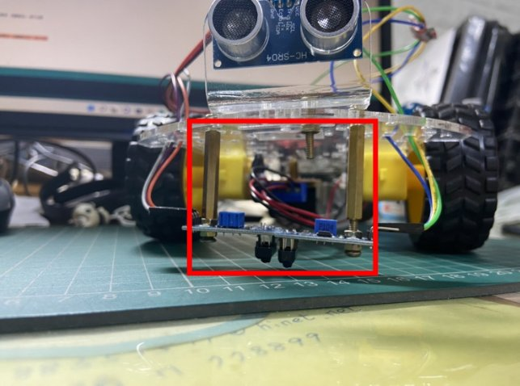

**計算機組織及微算機實驗 期末報告**

|班級|學號|姓名|
| :- | :- | :- |
|資二甲|110916042|楊宗翰|

1. 專題主題

了解計算機組織及微算機架構，並透過實作進行驗證與測試。本堂課程將進行循跡避障自走車的實作，並進行實際測試。

1. 功能規劃簡介

完成循跡避障自走車組裝後，撰寫Arduino程式控制自走車能夠沿著黑線行走，完成循跡的功能。另外，在遇到障礙物時能夠及時繞過障礙物，並繼續前進完成循跡。

1. 組裝過程說明

Step 1 :

裝上輔助輪

Step 2 :

`		`裝上馬達以及輪胎，再將電線焊接在馬達的接電腳

Step 3 :

裝上馬達驅動板，分別將把馬達上的線接上驅動板

之後在將輸出的線接上Arduino uno板上的接腳

Step 4 :

裝上Arduino板和Arduino uno擴充板，把剛剛馬達的接線一一接上腳位

Step 5 :

分別裝上超音波感測器和紅外線感測器，再將電線接上Arduino uno擴充板上

1. Arduino程式碼說明

**循跡行走程式碼 :**
**
`	`開頭

先偵測馬達腳位，總共四個，左右各兩個(前後)

`	`int SensorLeft = 3;       

int SensorRight =11;     讀取左右感測器輸入腳

int Speed 可設定速度

在 void setup()中 

分別讀入SensorLeft、SensorRight

然後讓馬達腳位輸出motorPin\_F1、motorPin\_B1、motorPin\_F2、motorPin\_B2

在 void loop() 中

SL、 SR先讀取感測器狀態 ， 之後進行判斷

1. 當左右感測器回饋值均為 0，即看到的均為白色，車子停止
1. 當左邊感測器看到黑色，回饋值為0，車子左轉
1. 當右邊感測器看到黑色，回饋值為0，車子右轉
1. 當左右感測器均看到黑色，回饋值均為1，車子往前

接下來停止、前進、後退、左轉、右轉函式

**避障部分 :**

開頭一樣先設定馬達接腳

const int trigPin = 13;    定義超音波模組觸發

const int echoPin = 12;    定義超音波模組接收腳

void setup() 函式中 設定超音波模組和馬達的輸入和輸出

void loop()中，先寫了

Serial.print("Distance in CM: ");

Serial.println(distance);

可以讓超音波感測器讀到的距離顯示在電腦上。

接下來設定超音波感測器 

給trigPin 高低電位

duration = pulseIn(echoPin, HIGH);

cm = (duration/2) / 29.1;     // 將時間換算成距離 cm

除以29.1的原因是音速每公分需要29.1 微秒：  1 / 0.034364 = 29.1 微秒/公分。

再來寫上判斷

當距離大於25cm就直走，小於的話就先停止，再後退，最後右轉。

最後的停止、前進、退後、左轉、右轉函式和循跡一樣。

1. 實際測試過程
   1) ` `循跡行走

1) ` `避障(加分部分)

1) ` `循跡行走+避障(加分部分)

1. 實作心得

循跡行走 : 

當初在測試循機車遇到最大的問題應該就是紅外線感測器的靈敏度問題，原本組裝的方式離地面太高，導致怎麼樣都感測不到地面的黑色軌道，後來更改了組裝方式，利用兩個長銅柱加高(如下圖)，再來去條紅外線感測器上的靈敏度旋鈕，這樣放在地面上就可以感測到了。

`	`後來測試的時候遇到了車子都會走超出軌道的問題，一開始以為是車速太快，這問題的確有占一小部分原因，另外一點是兩輪的轉速不同，所以程式碼中才會把左輪的速度再加110(就是要加這麼多才會轉到一樣，如果把初始速度調到120，右輪的馬達又不給力不會運轉)，最後一個原因是，當紅外線感測到需要右轉的時候，但右轉的角度不夠大，導致轉不回來才會跑出軌道，把以上

問題解決後，車子就順利運行了。 老師!我期中前有錄小提琴的音色寄給你，記得加分哈哈哈哈(怕被當)
